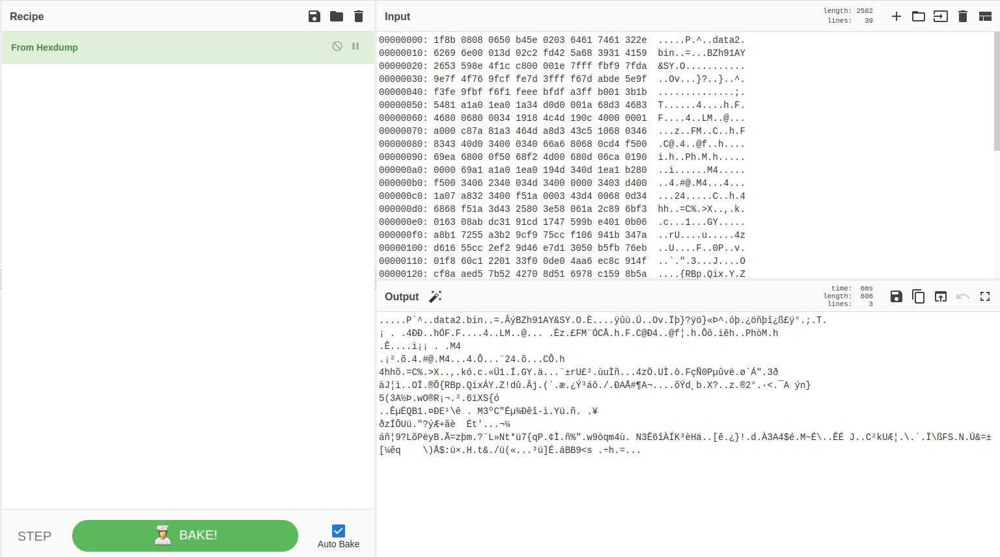
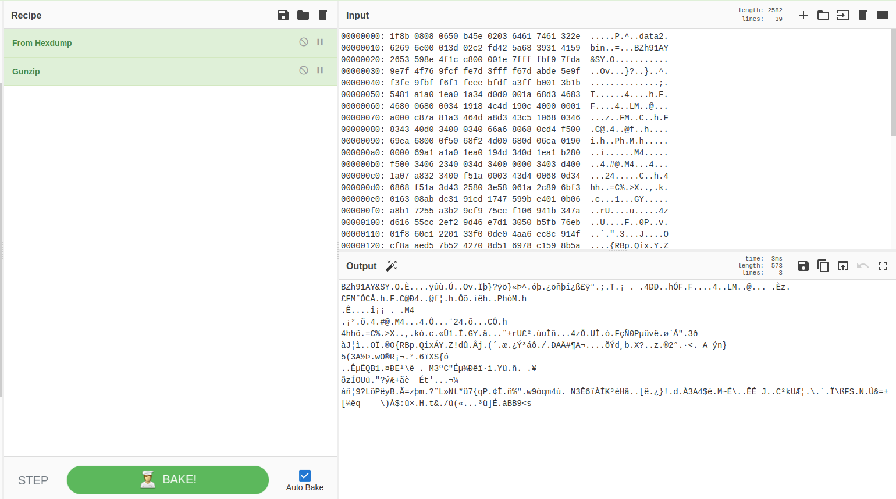
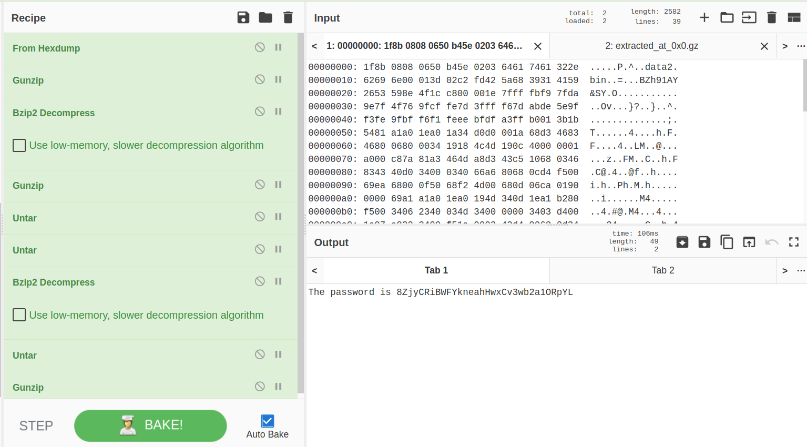

#Level 12
Connect to game via ssh on port 2220 using credentials bandit12:5Te8Y4drgCRfCx8ugdwuEX8KFC6k2EUu
_(format username:password)_
```sh
$ ssh -p 2220 bandit12@bandit.labs.overthewire.org
```

#Level Goal
The password for the next level is stored in the file data.txt, which is a hexdump of a file that has been repeatedly compressed. For this level it may be useful to create a directory under /tmp in which you can work using mkdir. For example: mkdir /tmp/myname123. Then copy the datafile using cp, and rename it using mv (read the manpages!)

**Commands you may need to solve this level**
grep, sort, uniq, strings, base64, tr, tar, gzip, bzip2, xxd, mkdir, cp, mv, file

**Helpful Reading Material**
Hex dump on Wikipedia

#Walkthrough
First for fun let's try to use CyberChef from github to manipulate data.txt file (https://gchq.github.io/CyberChef/).
Cat the data.txt then copy content to input of cyberchef and use 'From Hexdump' recipe.



Using Forensics recipe 'Detect File Type' we can see that result is gzip. Let's apply 'Gunzip' recipe from Compression (after we remove file detection recipe) to decompress.



We repeat file type detection and corresponding decompression until we get the flag.



**Tips**
- Using ```xxd -d <hexdumpfile>``` we can reconstruct the dumped file.
- Using ```file <filename>``` we can check type of the file.
- Uzing ```bzip2 -d <file.bz>``` we can extract bzip file.
- Using ```gunzip <file.gz>``` we can extract gzip file (this replaces original)
- Uzing ```tar -xf <file.tar>``` we can extrace tar file
- The decompression programs often require certain file extension so we need to rename files accordingly 

```sh
$ ssh -p 2220 bandit12@bandit.labs.overthewire.org
This is a OverTheWire game server. More information on http://www.overthewire.org/wargames

bandit12@bandit.labs.overthewire.org's password: 
Linux bandit.otw.local 5.4.8 x86_64 GNU/Linux

      ,----..            ,----,          .---.
     /   /   \         ,/   .`|         /. ./|
    /   .     :      ,`   .'  :     .--'.  ' ;
   .   /   ;.  \   ;    ;     /    /__./ \ : |
  .   ;   /  ` ; .'___,/    ,' .--'.  '   \' .
  ;   |  ; \ ; | |    :     | /___/ \ |    ' '
  |   :  | ; | ' ;    |.';  ; ;   \  \;      :
  .   |  ' ' ' : `----'  |  |  \   ;  `      |
  '   ;  \; /  |     '   :  ;   .   \    .\  ;
   \   \  ',  /      |   |  '    \   \   ' \ |
    ;   :    /       '   :  |     :   '  |--"
     \   \ .'        ;   |.'       \   \ ;
  www. `---` ver     '---' he       '---" ire.org


Welcome to OverTheWire!

If you find any problems, please report them to Steven or morla on
irc.overthewire.org.

--[ Playing the games ]--

  This machine might hold several wargames.
  If you are playing "somegame", then:

    * USERNAMES are somegame0, somegame1, ...
    * Most LEVELS are stored in /somegame/.
    * PASSWORDS for each level are stored in /etc/somegame_pass/.

  Write-access to homedirectories is disabled. It is advised to create a
  working directory with a hard-to-guess name in /tmp/.  You can use the
  command "mktemp -d" in order to generate a random and hard to guess
  directory in /tmp/.  Read-access to both /tmp/ and /proc/ is disabled
  so that users can not snoop on eachother. Files and directories with
  easily guessable or short names will be periodically deleted!

  Please play nice:

    * don't leave orphan processes running
    * don't leave exploit-files laying around
    * don't annoy other players
    * don't post passwords or spoilers
    * again, DONT POST SPOILERS!
      This includes writeups of your solution on your blog or website!

--[ Tips ]--

  This machine has a 64bit processor and many security-features enabled
  by default, although ASLR has been switched off.  The following
  compiler flags might be interesting:

    -m32                    compile for 32bit
    -fno-stack-protector    disable ProPolice
    -Wl,-z,norelro          disable relro

  In addition, the execstack tool can be used to flag the stack as
  executable on ELF binaries.

  Finally, network-access is limited for most levels by a local
  firewall.

--[ Tools ]--

 For your convenience we have installed a few usefull tools which you can find
 in the following locations:

    * gef (https://github.com/hugsy/gef) in /usr/local/gef/
    * pwndbg (https://github.com/pwndbg/pwndbg) in /usr/local/pwndbg/
    * peda (https://github.com/longld/peda.git) in /usr/local/peda/
    * gdbinit (https://github.com/gdbinit/Gdbinit) in /usr/local/gdbinit/
    * pwntools (https://github.com/Gallopsled/pwntools)
    * radare2 (http://www.radare.org/)
    * checksec.sh (http://www.trapkit.de/tools/checksec.html) in /usr/local/bin/checksec.sh

--[ More information ]--

  For more information regarding individual wargames, visit
  http://www.overthewire.org/wargames/

  For support, questions or comments, contact us through IRC on
  irc.overthewire.org #wargames.

  Enjoy your stay!

bandit12@bandit:~$ ls -al
total 24
drwxr-xr-x  2 root     root     4096 May  7  2020 .
drwxr-xr-x 41 root     root     4096 May  7  2020 ..
-rw-r--r--  1 root     root      220 May 15  2017 .bash_logout
-rw-r--r--  1 root     root     3526 May 15  2017 .bashrc
-rw-r-----  1 bandit13 bandit12 2582 May  7  2020 data.txt
-rw-r--r--  1 root     root      675 May 15  2017 .profile
bandit12@bandit:~$ mkdir /tmp/bandit12 && cp data.txt /tmp/bandit12 && cd /tmp/bandit12
bandit12@bandit:/tmp/bandit12$ ls -al
total 1996
drwxr-sr-x 2 bandit12 root    4096 Jun  4 14:26 .
drwxrws-wt 1 root     root 2031616 Jun  4 14:26 ..
-rw-r----- 1 bandit12 root    2582 Jun  4 14:26 data.txt
bandit12@bandit:/tmp/bandit12$ xxd -r data.txt > 1
bandit12@bandit:/tmp/bandit12$ file 1
1: gzip compressed data, was "data2.bin", last modified: Thu May  7 18:14:30 2020, max compression, from Unix
bandit12@bandit:/tmp/bandit12$ mv 1 1.gz
bandit12@bandit:/tmp/bandit12$ gunzip 1.gz 
bandit12@bandit:/tmp/bandit12$ ls -al
total 2000
drwxr-sr-x 2 bandit12 root    4096 Jun  4 14:28 .
drwxrws-wt 1 root     root 2031616 Jun  4 14:28 ..
-rw-r--r-- 1 bandit12 root     573 Jun  4 14:27 1
-rw-r----- 1 bandit12 root    2582 Jun  4 14:26 data.txt
bandit12@bandit:/tmp/bandit12$ file 1
1: bzip2 compressed data, block size = 900k
bandit12@bandit:/tmp/bandit12$ cp 1 2.bz
bandit12@bandit:/tmp/bandit12$ ls
1  2.bz  data.txt
bandit12@bandit:/tmp/bandit12$ bzip2 -d 2.bz
bandit12@bandit:/tmp/bandit12$ ls
1  2  data.txt
bandit12@bandit:/tmp/bandit12$ file 2
2: gzip compressed data, was "data4.bin", last modified: Thu May  7 18:14:30 2020, max compression, from Unix
bandit12@bandit:/tmp/bandit12$ cp 2 3.gz
bandit12@bandit:/tmp/bandit12$ ls
1  2  3.gz  data.txt
bandit12@bandit:/tmp/bandit12$ gunzip 3.gz 
bandit12@bandit:/tmp/bandit12$ file 3 
3: POSIX tar archive (GNU)
bandit12@bandit:/tmp/bandit12$ cp 3 4.tar
bandit12@bandit:/tmp/bandit12$ ls
1  2  3  4.tar  data.txt
bandit12@bandit:/tmp/bandit12$ tar -xf 4.tar 
bandit12@bandit:/tmp/bandit12$ ls
1  2  3  4.tar  data5.bin  data.txt
bandit12@bandit:/tmp/bandit12$ file data5.bin 
data5.bin: POSIX tar archive (GNU)
bandit12@bandit:/tmp/bandit12$ mv data5.bin data5.tar
bandit12@bandit:/tmp/bandit12$ tar -xf data5.tar 
bandit12@bandit:/tmp/bandit12$ ls
1  2  3  4.tar  data5.tar  data6.bin  data.txt
bandit12@bandit:/tmp/bandit12$ file data6.bin 
data6.bin: bzip2 compressed data, block size = 900k
bandit12@bandit:/tmp/bandit12$ mv data6.bin data6.bz
bandit12@bandit:/tmp/bandit12$ bzip2 -d data6.bz
bandit12@bandit:/tmp/bandit12$ ls
1  2  3  4.tar  data5.tar  data6  data.txt
bandit12@bandit:/tmp/bandit12$ file data6
data6: POSIX tar archive (GNU)
bandit12@bandit:/tmp/bandit12$ mv data6 data6.tar
andit12@bandit:/tmp/bandit12$ mv data6 data6.tar
bandit12@bandit:/tmp/bandit12$ tar -xf data6.tar 
bandit12@bandit:/tmp/bandit12$ ls
1  2  3  4.tar  data5.tar  data6.tar  data8.bin  data.txt
bandit12@bandit:/tmp/bandit12$ file data8.bin 
data8.bin: gzip compressed data, was "data9.bin", last modified: Thu May  7 18:14:30 2020, max compression, from Unix
bandit12@bandit:/tmp/bandit12$ mv data8.bin data8.gz
bandit12@bandit:/tmp/bandit12$ gunzip data8.gz 
bandit12@bandit:/tmp/bandit12$ ls
1  2  3  4.tar  data5.tar  data6.tar  data8  data.txt
bandit12@bandit:/tmp/bandit12$ file data8
data8: ASCII text
bandit12@bandit:/tmp/bandit12$ cat data8
The password is 8ZjyCRiBWFYkneahHwxCv3wb2a1ORpYL
bandit12@bandit:/tmp/bandit12$ cd
bandit12@bandit:~$ rm -fr /tmp/bandit12
bandit12@bandit:~$ exit
logout
Connection to bandit.labs.overthewire.org closed.
```